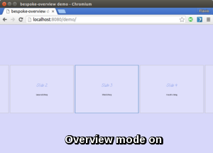
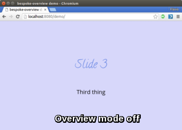

[](https://travis-ci.org/fegemo/bespoke-overview) [](https://coveralls.io/r/fegemo/bespoke-overview)

# bespoke-simple-overview

Displays an overview version of a bespoke presentation when `Esc` (configurable)
is pressed.




## Download

Download the [production version][min] or the [development version][max], or use a [package manager](#package-managers).

[min]: https://raw.github.com/fegemo/bespoke-simple-overview/master/dist/bespoke-simple-overview.min.js
[max]: https://raw.github.com/fegemo/bespoke-simple-overview/master/dist/bespoke-simple-overview.js

## Usage

This plugin is shipped in a [UMD format](https://github.com/umdjs/umd), meaning that it is available as a CommonJS/AMD module or browser global.

For example, when using CommonJS modules:

```js
var bespoke = require('bespoke'),
  overview = require('bespoke-simple-overview');

bespoke.from('#presentation', [
  overview()
]);
```

When using browser globals:

```js
bespoke.from('#presentation', [
  bespoke.plugins.overview()
]);
```

There are a few options that can be used to configure the plugin:

```js
bespoke.from('#presentation', [
  overview({
    activationKey: 'c',   // Defaults to ESC (which: 27)
    insertStyles: false   // Defaults to true
  })
]);
```

By default, bespoke-simple-overview uses the `Esc` key to activate/deactivate the
overview mode, but it can be changed using the option **`activationKey`**.

The plugin works by simply toggling a `.bespoke-simple-overview` class on the `deck.parent` element. The option **`insertStyles`** (default: `true`) is used to ask the plugin to inject some CSS rules that use `.bespoke-simple-overview` to style the deck when the presentation enters overview mode (see lib/bespoke-simple-overview.css). When set to `false`, you are free to provide the styling the way you want for the presentation.

## Peer Dependencies

This plugin needs to have `bespoke-classes` so the deck slides get all the state classes (e.g., `.bespoke-before`, `bespoke-after` etc.).

## Load Order of Plugins

If your presentation uses the `bespoke-bullets` plugin, the `bespoke-simple-overview` plugin needs to be loaded **before** it, like this:

```js
window.deck = bespoke.from('article', [
  bespoke.themes.fancy(),
  bespoke.plugins.keys(),
  bespoke.plugins.classes(),
  bespoke.plugins.simpleOverview(),
  bespoke.plugins.bullets()
]);
```

The reason for this is that when in overview mode, this plugin needs to
suppress the "sub steps" imposed by `bespoke-bullets` so that navigating to
the next/previous slides effectively changes the active slide, even when
more bullets would still be revealed.

## Default Styling

The plugin simply adds/removes a `.bespoke-simple-overview` class on the
`deck.parent` element when the `activationKey` is pressed.

By default, it adds some CSS rules based on that class. To see which CSS
rules are added by default, see the file [`lib/bespoke-simple-overview.css`](https://github.com/fegemo/bespoke-simple-overview/blob/master/lib/bespoke-simple-overview.css).

They basically add a rule to the `.bespoke-slide` class with:
```css
.bespoke-simple-overview .bespoke-slide {
  transform: translated3d(x, 0, -2000px)  
}
```
...so that the slides go further from the "camera" and become smaller. The "x"
varies for each slide so that the ones with class `.bespoke-before` appear to
the left and the ones with `.bespoke-after` to the right, accordingly.

Tipically, about 5 `.bespoke-slide`s are shown:
- The current one: `.bespoke-slide.bespoke-active`
- Two before: `.bespoke-slide.bespoke-before`
- Two after: `.bespoke-slide.bespoke-after`

## Events

There are 3 events exposed by this plugin:
- `simple-overview.enable`: Goes into overview mode
- `simple-overview.disable`: Leaves to regular mode
- `simple-overview.toggle`: Toggles between regular/overview mode

To trigger such event:
```js
deck.fire('simple-overview.disable');
```

## Package managers

### npm

```bash
$ npm install bespoke-simple-overview
```

### Bower

```bash
$ bower install bespoke-simple-overview
```

## Credits

This plugin was built with [generator-bespokeplugin](https://github.com/markdalgleish/generator-bespokeplugin).

## License

[MIT License](http://en.wikipedia.org/wiki/MIT_License)
